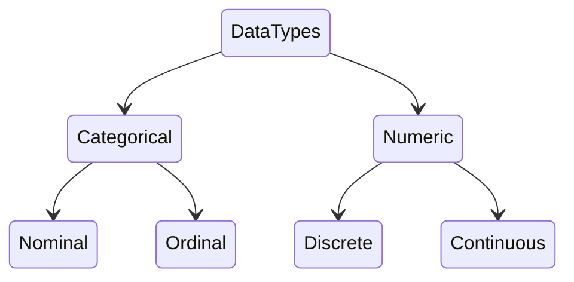

# Data Scientist

Is the one who is proficient in both data analysis and programming. They are
able to take data and turn it into information that can be used to make
decisions. They are able to take information and turn it into knowledge that can
be used to make decisions. They are able to take knowledge and turn it into
wisdom that can be used to make decisions. They are able to take wisdom and turn
it into action that can be used to make decisions.

## [Exploratory Data Analysis (EDA)](exploratory_data_analysis.ipynb)

Is an approach to **analyzing data sets** to **summarize their main
characteristics**, often with visual methods.

A [statistical](/math/statistics/statistics.md) model can be used or not, but
primarily EDA is for seeing what the data can tell us beyond the formal modeling
or hypothesis testing task. So it is not a substitute for statistical inference.

1. Make Questions about the data
2. Get metadata to understand the data (size)
3. Categorizate the variables
4. Validating and cleaning the data
5. Stablish relationships between variables

### Data Analysis Steps

1. **[Data Collection](data%20engineering.md#ETL)**: The first step in the data
   analysis process is to collect the data. This can be done by **asking people
   to fill out a survey** or by **collecting data from a database**.
   - **Primary** is **collected for the specific purpose of answering a
     particular research question**.
   - **Secondary** is data that **has already been collected for a purpose other
     than the one at hand**.
   - **Qualitative** is data that **describes characteristics**. It is **usually
     text-based**.

2. **Data Preparation**: The second step in the data analysis process is to
   prepare the data (cleaning and organizating) so that it can be analyzed.

3. **Data Analysis**: This step involves **summarizing the data** and **looking
   for patterns** in the data.
   - **Descriptive**: **Summarize the main characteristics of the data**. It is
     used to **describe the data** and to **understand the data set better**.
   - **Diagnostic**: process of **identifying the presence of errors or other
     problems**.
   - **Predictive**: makes predictions about the future.
   - **Prescriptive**: used to make recommendations for actions.

4. **Data Communication**: The sixth step in the data analysis process is to
   communicate the data. This step involves **presenting the data** and
   **conveying the meaning of the data** to others.

## Detection and Exploration of Outliers

## Imputation of Missing Values
