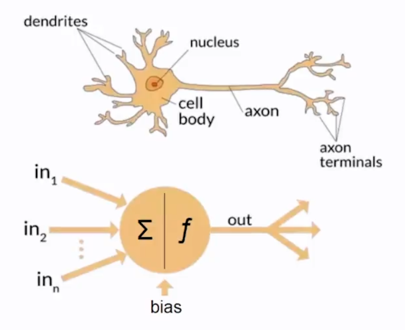
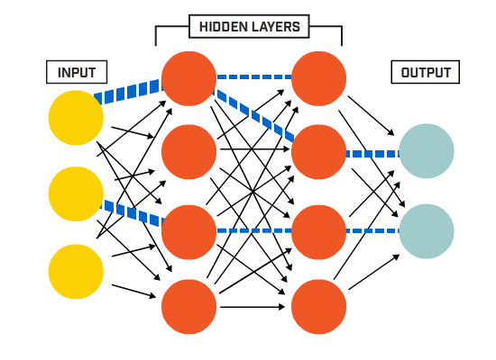

# [Neural Network]([http:](https://en.wikipedia.org/wiki/Artificial_neural_network))

An artificial neural network (ANN) **is composed of interconnected artificial
neurons that mimic the neurons in a biological brain**. These neurons receive
and process signals, transmitting them to connected neurons. The connections
between neurons, known as edges, carry signals with adjustable weights. Neurons
often have a threshold for signal transmission. Neurons are organized into
layers, each layer performing unique transformations on inputs. Signals
propagate from the input layer to the output layer, potentially traversing the
layers multiple times.



## Perceptron

Is a single layer neural network that can be used for two-class classification
problems and provides the foundation for later developing much larger© networks.

```mermaid
graph LRé
    subgraph Input
        A((x1))
        B((x2))
        C((x3)) 
    end

    subgraph HiddenLayer 1
        A --> D((h1))
        A --> E((h2))
        B --> D((h1))
        B --> E((h2))
        C --> D((h1))
        C --> E((h2))
    end
    
    subgraph output
        D --> H{{y}}
        E --> H{{y}}
    end
```

Where `x` is an input variable that is multiplied by a weight `w` and added to a
bias `b` to produce an output `h`. The output `h` is then passed through an
**activation function `f`** to produce the final output `y`.

$$
\begin{aligned}
h &= \sum_{i=1}^{n} w_ix_i + b \\
y &= f(h)
\end{aligned}
$$

## Architecture

A neural network is composed of multiple layers of neurons, each layer
performing unique transformations on its inputs. The layers are organized into a
directed acyclic graph (DAG), with edges connecting layers to their subsequent
layers. The DAG is often visualized as a network diagram, as shown below.



## Activation Functions

Are **mathematical equations that determine the output of a neural network**.
The function is attached to each neuron in the network, and determines whether
it should be activated (“fired”) or not, based on whether each neuron’s input is
relevant for the model’s prediction.\
Activation functions also help normalize the output of each neuron to a range
between 1 and 0 or between -1 and 1.
